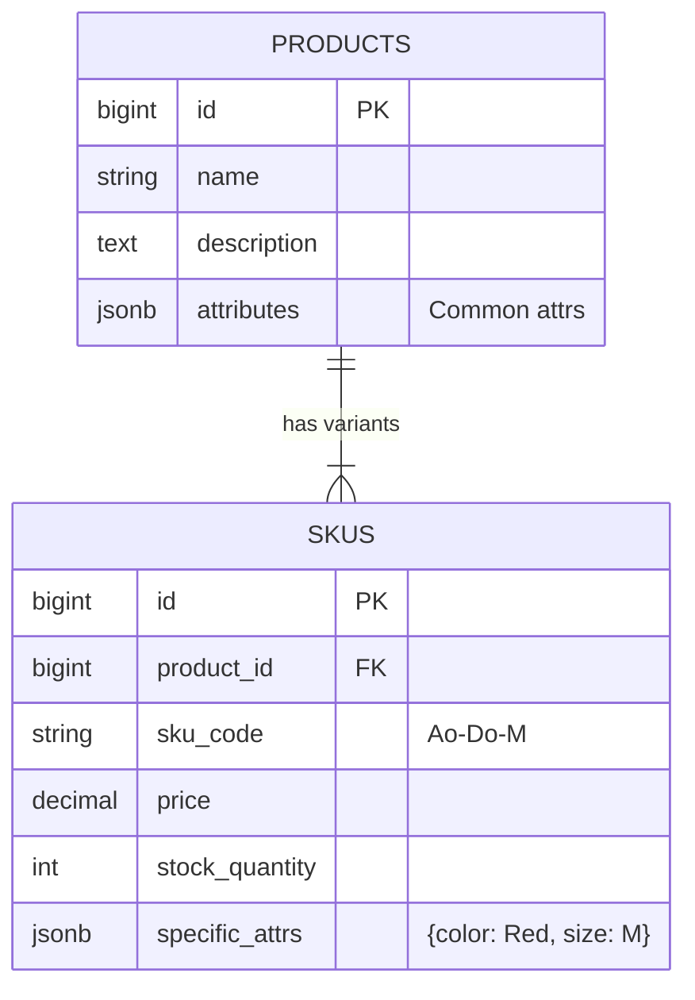

# Kiến Trúc Cơ Sở Dữ Liệu E-commerce: Từ 0 đến Hàng Triệu Users

> Hướng dẫn chuyên sâu về thiết kế CSDL cho sàn thương mại điện tử, xử lý các bài toán hóc búa như tồn kho, biến thể sản phẩm và tối ưu hiệu năng.

---

---

## 0. Tư Duy CSDL: Mô Hình Hóa Thực Tế (Digitalization)

Trước khi nói về bảng (Table) hay cột (Column), hãy hiểu bản chất: **CSDL là bản sao kỹ thuật số của thế giới thực.**

Chúng ta lược bỏ các chi tiết thừa (bụi bặm trên kệ hàng, thái độ nhân viên) và chỉ giữ lại **Thuộc tính cốt lõi** để máy tính quản lý.

### Ví Dụ: Từ Siêu Thị ➔ E-commerce

| 🛒 Thế Giới Thực (Physical Reality) | 💾 CSDL (Database Mapping) |
|:---|:---|
| Khách hàng tên Hùng, 30 tuổi, đang cầm giỏ hàng | `Table Users`: {name: "Hùng", age: 30} |
| Kệ hàng bán Áo thun, size M, màu Đỏ | `Table Products`: {name: "Áo thun", sku: "AT-M-RED"} |
| Hùng bỏ áo vào giỏ và ra quầy thu ngân | `Table Orders`: {user_id: 1, items: [...], status: "PENDING"} |

> **➔ Nhiệm vụ của bạn là vẽ lại thế giới đó vào trong máy tính sao cho chính xác nhất.**

---

## 1. Chiến Lược: Polyglot Persistence (Đa Dạng Hóa Lưu Trữ)

Một hệ thống E-commerce hiện đại không bao giờ chỉ dùng 1 loại CSDL. Chúng ta kết hợp công cụ tốt nhất cho từng việc.

| Loại Dữ Liệu | Công Nghệ Khuyên Dùng | Lý Do |
|:---|:---|:---|
| **Core Data** (User, Order, Payment) | **RDBMS (PostgreSQL/MySQL)** | Cần tính nhất quán tuyệt đối (ACID). Transaction là bắt buộc. |
| **Catalog** (Product Details) | **NoSQL (MongoDB)** | Schema linh động (Áo có size/màu, Laptop có RAM/CPU). |
| **Caching/Session** | **Redis** | Truy xuất siêu tốc (<1ms) cho Giỏ hàng, Session đăng nhập. |
| **Search** | **Elasticsearch** | Tìm kiếm full-text, lọc nhiều tiêu chí, gợi ý từ khóa. |

### Tại sao RDBMS cần ACID cho Đơn Hàng?
Trong E-commerce, ACID là 4 vệ sĩ bảo vệ tiền của bạn:
- **A (Atomicity - Tính Nguyên Tố)**: Đảm bảo một giao dịch (transaction) được coi là một đơn vị không thể chia tách; hoặc tất cả các thao tác trong giao dịch đều thành công, hoặc toàn bộ giao dịch bị hủy bỏ (rollback), không có trạng thái "nửa chừng" nào xảy ra, ngăn chặn việc mất hoặc tạo dữ liệu không nhất quán.
- **C (Consistency - Tính Nhất Quán)**: Tồn kho không bao giờ được âm. Ràng buộc `CHECK (stock >= 0)` sẽ chặn mọi giá trị sai.
- **I (Isolation - Tính Độc Lập)**: Hai người mua món hàng cuối cùng cùng lúc? DB sẽ xếp hàng họ, người đến sau nhận lỗi "Hết hàng".
- **D (Durability - Tính Bền Vững)**: Khi báo "Thanh toán thành công", dù server sập ngay lúc đó, dữ liệu vẫn an toàn.


### 1. So Sánh Đặc Tính Kỹ Thuật (Technical Specs)

Bảng dưới đây tập trung vào sự khác biệt cốt lõi về mặt công nghệ và vận hành.

| Đặc Điểm | RDBMS (SQL) | NoSQL (Non-Relational) |
| :--- | :--- | :--- |
| **Đại diện** | PostgreSQL, MySQL, Oracle | MongoDB, Redis, Cassandra |
| **Cấu trúc dữ liệu** | **Structured**. Bảng & Cột cố định. | **Flexible**. JSON, Key-Value, Graph. |
| **Schema** | **Right (Cứng)**. Thay đổi cấu trúc rất khó (Migration). | **Dynamic (Động)**. Sửa đổi tùy ý không cần downtime. |
| **Consistency** | **Strong (ACID)**. Tin cậy tuyệt đối. | **Eventual (BASE)**. Chấp nhận độ trễ để lấy tốc độ. |
| **Scaling** | **Vertical (Scale Up)**. Nâng cấp phần cứng server. | **Horizontal (Scale Out)**. Phân tán ra nhiều máy (Sharding). |

### 2. Phân Tích Use Case & Ví Dụ Cụ Thể

Thay vì so sánh chung chung, hãy xem xét từng kịch bản nghiệp vụ để chọn công cụ phù hợp.

#### ✅ Case A: Dữ Liệu Giao Dịch Quan Trọng (Transactional Data)
*   **Nghiệp vụ**: Quản lý Đơn hàng (Orders), Thanh toán (Payments), Tồn kho (Inventory).
*   **Yêu cầu**: **ACID**. Tiền không được mất, tồn kho không được âm.
*   **Chọn**: **RDBMS (PostgreSQL/MySQL)**.
*   **Ví dụ**: Trừ tồn kho khi đặt hàng.
    ```sql
    BEGIN;
    UPDATE skus SET stock = stock - 1 WHERE id = 101 AND stock > 0;
    INSERT INTO orders (user_id, total) VALUES (1, 500);
    COMMIT; -- Đảm bảo cả 2 lệnh cùng thành công hoặc cùng thất bại
    ```

#### ✅ Case B: Danh Mục Sản Phẩm Phức Tạp (Complex Catalog)
*   **Nghiệp vụ**: Sàn TMĐT bán đủ thứ: Laptop (CPU, RAM), Sách (Tác giả, Số trang), Quần áo (Size, Màu).
*   **Yêu cầu**: **Flexible Schema**. Không thể tạo bảng có 1000 cột cho mọi loại thuộc tính.
*   **Chọn**: **NoSQL Document (MongoDB)** hoặc **PostgreSQL JSONB**.
*   **Ví dụ**: Lưu cấu trúc sản phẩm khác nhau trong cùng 1 collection.
    ```json
    // Laptop
    { "id": "A1", "type": "laptop", "attrs": { "ram": "16GB", "cpu": "M1" } }
    
    // Áo thun
    { "id": "B2", "type": "clothing", "attrs": { "size": "L", "material": "Cotton" } }
    ```

#### ✅ Case C: Tốc Độ & Truy Cập Tạm Thời (High Speed / Ephemeral)
*   **Nghiệp vụ**: Giỏ hàng (Shopping Cart), Session đăng nhập, Bộ đếm Views real-time.
*   **Yêu cầu**: **Low Latency**. Phản hồi < 1ms, chịu tải hàng triệu request/giây.
*   **Chọn**: **Key-Value Store (Redis)**.
*   **Ví dụ**: Lưu giỏ hàng tạm cho user (TTL 24h).
    ```bash
    # Key: cart:user_id, Order: timestamp, Value: product_id:quantity
    HSET cart:100 "product:99" "2" 
    EXPIRE cart:100 86400 # Tự xóa sau 24h
    ```

#### ✅ Case D: Dữ Liệu Lớn & Ghi Nhiều (Big Data / Write-Heavy)
*   **Nghiệp vụ**: Nhật ký hoạt động (User Logs), Đánh giá sản phẩm (Reviews), Tin nhắn chat.
*   **Yêu cầu**: **High Write Throughput**. Ghi cực nhanh, không cần sửa đổi (Append-only).
*   **Chọn**: **Column-family (Cassandra/ScyllaDB)**.
*   **Ví dụ**: Ghi log mỗi khi user xem 1 sản phẩm.
    ```sql
    -- Cassandra CQL
    INSERT INTO product_views (product_id, user_id, timestamp) 
    VALUES ('uuid-laptop', 'uuid-user', toTimestamp(now()));
    ```

---


---

## 2. Quy Trình 4 Giai Đoạn Thiết Kế (The 4 Design Phases)

Trước khi viết dòng code SQL đầu tiên, một kiến trúc sư E-commerce cần đi qua 4 bước:

`Phân Tích` ➔ `Ý Tưởng` ➔ `Logic` ➔ `Vật Lý`

### GĐ 1: Phân Tích Yêu Cầu (Requirements Analysis)
Xác định nghiệp vụ đặc thù của sàn (Ví dụ: Sự kiện Flash Sale iPhone 15).

1.  **Yêu cầu Chức năng (Functional):**
    -   Người dùng xem sản phẩm, thêm vào giỏ, và thanh toán nhanh.
    -   Hệ thống tự động kích hoạt giá khuyến mãi đúng 12:00:00.
    -   Mỗi user chỉ được mua tối đa 1 chiếc.

2.  **Yêu cầu Phi Chức năng (Non-Functional):**
    -   **High Concurrency:** Chịu tải 1 triệu CCU (Concurrent Users) trong 1 phút mở bán.
    -   **Consistency (Tính Nhất Quán):** Tuyệt đối **KHÔNG** được bán quá số lượng kho (Overselling). Chấp nhận chậm một chút chứ không được sai tồn kho.
    -   **Latency:** Phản hồi xem trang < 200ms, đặt hàng < 2s.

3.  **Yêu cầu Dữ Liệu (Data):**
    -   Cần lưu trữ: Sản phẩm (SKU), Tồn kho (Inventory), Giỏ hàng (Cart), Đơn hàng (Order), Voucher.
    -   Dữ liệu lịch sử: Ai đã mua? Lúc mấy giờ? Dùng voucher nào?

### GĐ 2: Thiết Kế Ý Tưởng (Conceptual Design)
Vẽ sơ đồ **ERD (Entity-Relationship Diagram)** mức cao, chưa quan tâm đến công nghệ.
- `[User]` --(mua)--> `[Order]`
- `[Product]` --(có)--> `[Variant]`
- `[Order]` --(áp dụng)--> `[Voucher]`

**Chi Tiết Về Các Loại Quan Hệ (Relation):**
Hệ thống E-commerce được dệt nên bởi 3 loại quan hệ cốt lõi:

1. **1-1 (Một - Một)**:
    - *Ví dụ:* `User` và `UserProfile` (Thông tin riêng tư).
    - *Ý nghĩa:* Một User chỉ có duy nhất một Profile. Một Profile chỉ thuộc về một User.
    ```sql
    -- PK của bảng Profile cũng chính là FK trỏ về bảng User
    CREATE TABLE user_profiles (
        user_id BIGINT PRIMARY KEY REFERENCES users(id),
        address TEXT
    );
    ```
    
2. **1-N (Một - Nhiều)**:
    - *Ví dụ:* `User` và `Order`.
    - *Ý nghĩa:* Một khách hàng có thể đặt **nhiều** đơn hàng. Nhưng một đơn hàng chỉ thuộc về **một** khách hàng.

3. **N-N (Nhiều - Nhiều)**:
    - *Ví dụ:* `Order` và `Product`.
    - *Ý nghĩa:* Một đơn hàng chứa **nhiều** sản phẩm. Một sản phẩm (ví dụ: iPhone 15) có thể nằm trong **nhiều** đơn hàng khác nhau.
    - *Lưu ý:* Để vẽ được N-N trong CSDL, ta bắt buộc phải dùng bảng trung gian (vd: `OrderItems`).

    **Minh Họa Dữ Liệu Thực Tế:**

    *1-N (User - Order): Khóa ngoại (user_id) nằm ở bảng "Nhiều"*
    ```
    Table: Users                 Table: Orders
    ┌────┬───────┐              ┌────┬─────────┬───────┐
    │ id │ name  │              │ id │ user_id │ total │
    ├────┼───────┤              ├────┼─────────┼───────┤
    │ 1  │ Hùng  │ ◄──────────┐ │ 101│ 1       │ 50$   │
    └────┴───────┘            └─│ 102│ 1       │ 100$  │
                                └────┴─────────┴───────┘
    ```sql
    CREATE TABLE orders (
        id BIGSERIAL PRIMARY KEY,
        user_id BIGINT REFERENCES users(id), -- FK nằm ở bảng "Nhiều"
        total DECIMAL(15,2)
    );
    ```

    *N-N (Order - Product): Cần bảng trung gian (OrderItems)*
    ```
    Table: Orders       Bridge: OrderItems        Table: Products
    ┌────┐             ┌──────────┬────────────┐   ┌────┬─────────┐
    │ id │             │ order_id │ product_id │   │ id │ name    │
    ├────┤             ├──────────┼────────────┤   ├────┼─────────┤
    │ 99 │ ◄────────── │ 99       │ A          │ ► │ A  │ iPhone  │
    └────┘             │ 99       │ B          │ ► │ B  │ Mac     │
                       └──────────┴────────────┘   └────┴─────────┘
    ```sql
    -- Bảng trung gian giải quyết quan hệ N-N
    CREATE TABLE order_items (
        order_id BIGINT REFERENCES orders(id),
        product_id BIGINT REFERENCES products(id),
        quantity INTEGER,
        PRIMARY KEY (order_id, product_id) -- PK kết hợp
    );
    ```

### GĐ 3: Thiết Kế Logic (Logical Design)
Chuyển đổi sơ đồ ERD thành các cấu trúc bảng cụ thể, chuẩn hóa dữ liệu, xác định Khóa và Ràng buộc logic (chưa quan tâm kiểu dữ liệu int hay varchar).

1.  **Chuẩn hóa (Normalization):** Đưa dữ liệu về dạng chuẩn 3 (3NF) để tránh dư thừa.
    -   *Ví dụ:* Thay vì lưu `tên_tỉnh_thành` trực tiếp vào bảng User, ta tách ra bảng `Provinces` và chỉ lưu `province_id`.

2.  **Xác định Khóa (Keys):**
    -   **Primary Key (PK):** Định danh duy nhất (User ID, Order ID).
    -   **Foreign Key (FK):** Liên kết các bảng (Order.user_id trỏ về Users.id).

3.  **Ràng buộc Logic (Constraints):**
    -   `Unique`: Mã giảm giá (voucher_code) không được trùng nhau.
    -   `Not Null`: Email đăng ký không được để trống.
    -   `Check`: Số lượng tồn kho (stock) phải >= 0.

*Output của bước này là bản thiết kế chi tiết danh sách các bảng và cột (Chưa phải SQL).*

**Ví dụ Output Logic (Bảng Customer):**
| Tên Cột | Kiểu Logic | Ràng buộc | Mô tả |
| :--- | :--- | :--- | :--- |
| `id` | Số nguyên | **PK** | Định danh khách hàng |
| `email` | Chuỗi | **Unique, Not Null** | Email đăng nhập |
| `age` | Số nguyên | **Check > 13** | Tuổi phải lớn hơn 13 |
| `rank_id` | Số nguyên | **FK -> Ranks** | Liên kết bảng Hạng thành viên |

### GĐ 4: Thiết Kế Vật Lý (Physical Design)
Cài đặt cụ thể trên Database Engine (PostgreSQL/MySQL), quan tâm đến hiệu năng thực tế và cách lưu trữ.

1.  **Chính xác dữ liệu (Precision):**
    -   *Ví dụ:* Dùng `DECIMAL(15,2)` thay vì `FLOAT` để tránh sai số 0.0000001 khi tính tiền.
    -   Dùng `TIMESTAMPTZ` để lưu thời gian có múi giờ, tránh loạn giờ khi đơn hàng từ nhiều quốc gia.

2.  **Phân vùng dữ liệu (Partitioning):**
    -   Giúp truy vấn nhanh hơn trên bảng hàng chục triệu row.
    -   *Ví dụ (PostgreSQL):*
    ```sql
    CREATE TABLE orders (
        id BIGINT NOT NULL,
        created_at TIMESTAMP NOT NULL,
        total_amount DECIMAL(15,2),
        PRIMARY KEY (id, created_at)
    ) PARTITION BY RANGE (created_at);

    -- Tách nhỏ dữ liệu theo tháng
    CREATE TABLE orders_2024_01 PARTITION OF orders
        FOR VALUES FROM ('2024-01-01') TO ('2024-02-01');
    ```

3.  **Chi tiết lưu trữ (Storage):**
    -   Tạo **Index** trên các cột hay tìm kiếm (vd: `phone`, `email`).
    -   Chọn JSONB (trong Postgre) cho các thuộc tính sản phẩm linh hoạt không cần join nhiều bảng.

---

## 3. Thiết Kế Schema Cốt Lõi (SQL Focus)

Dưới đây là thiết kế chuẩn cho các bảng quan trọng nhất trong RDBMS.

### 👤 A. Users & Authentication

Tách biệt thông tin đăng nhập và hồ sơ cá nhân.

```sql
CREATE TABLE users (
    id BIGSERIAL PRIMARY KEY,
    email VARCHAR(255) UNIQUE NOT NULL,
    password_hash VARCHAR(255) NOT NULL,
    status VARCHAR(50) DEFAULT 'ACTIVE', -- ACTIVE, BANNED
    created_at TIMESTAMP DEFAULT NOW()
);

CREATE TABLE user_profiles (
    user_id BIGINT PRIMARY KEY REFERENCES users(id),
    full_name VARCHAR(100),
    phone VARCHAR(20),
    avatar_url TEXT,
    date_of_birth DATE
);
```
> **Tại sao lại tách 2 bảng (1-1)?**
> 1.  **Hiệu năng (Performance)**: Bảng `users` rất nhẹ, giúp việc Login/Auth cực nhanh vì RDBMS load ít dữ liệu vào RAM hơn.
> 2.  **Bảo mật**: Nếu hacker SQL Injection lấy được danh sách `users`, họ không lấy được thông tin cá nhân (tên, sđt) ngay lập tức nếu chưa query sang bảng profile.
> 3.  **Linh hoạt**: Dễ dàng mở rộng thêm các trường thông tin phụ (sở thích, địa chỉ...) vào `user_profiles` mà không làm phình to bảng xác thực cốt lõi.

### 📦 B. Product Catalog (Sản Phẩm & Biến Thể)

Bài toán khó: Một chiếc áo có nhiều màu (Đỏ, Xanh) và Size (M, L). Mỗi biến thể có giá và tồn kho riêng.

**Giải Pháp: Mô hình Product - SKU**

1.  **Products**: Chứa thông tin chung (Tên, Mô tả, Brand).
2.  **SKUs (Stock Keeping Unit)**: Chứa thông tin cụ thể (Giá, Tồn kho, Thuộc tính).



### Chiến Lược: Normalization vs Denormalization

1.  **Normalization (3NF) cho Orders**:
    -   Tách `Orders` và `OrderItems` để tránh lặp lại thông tin người mua/đơn hàng cho mỗi món hàng.
    -   Giúp dữ liệu gọn nhẹ, nhất quán.

2.  **Denormalization cho Catalog (Product Attributes)**:
    -   Các thuộc tính như Màu sắc, CPU, RAM rất đa dạng.
    -   Thay vì tạo bảng `ProductAttributes` (EAV Pattern) phức tạp, ta dùng cột **JSONB** (Denormalized) trong PostgreSQL.
    -   Lợi ích: Đọc nhanh (không cần JOIN), schema linh động.

### 🛒 C. Orders (Đơn Hàng)

Lưu ý quan trọng: **Copy dữ liệu giá tại thời điểm mua.**
Nếu giá sản phẩm thay đổi sau này, giá trong đơn hàng cũ KHÔNG được đổi.

```sql
CREATE TABLE orders (
    id BIGSERIAL PRIMARY KEY,
    user_id BIGINT REFERENCES users(id),
    total_amount DECIMAL(15, 2) NOT NULL,
    status VARCHAR(50), -- PENDING, PAID, SHIPPED
    created_at TIMESTAMP DEFAULT NOW()
);

CREATE TABLE order_items (
    id BIGSERIAL PRIMARY KEY,
    order_id BIGINT REFERENCES orders(id),
    sku_id BIGINT REFERENCES skus(id),
    quantity INT NOT NULL,
    unit_price DECIMAL(15, 2) NOT NULL -- ⚠️ Lưu giá TẠI THỜI ĐIỂM MUA
);
```

---

---

## 4. Các Bài Toán Hóc Búa (Advanced Scenarios)

### 🔥 Bài toán 1: Concurrency Control (Tránh Bán Quá Số Lượng)

**Tình huống:** Tồn kho còn 1 cái. User A và User B cùng bấm "Mua" cùng 1 mili giây.
Nếu code check `if (stock > 0)` bình thường, cả 2 đều qua ➔ Tồn kho âm (-1).

**Giải Pháp 1: Pessimistic Locking (Khóa Bi Quan)**
Dành cho hệ thống cần an toàn tuyệt đối, chấp nhận chậm một chút.

```sql
BEGIN;
-- Khóa dòng dữ liệu này, không cho ai đọc/ghi cho đến khi commit
SELECT stock_quantity FROM skus WHERE id = 100 FOR UPDATE; 

-- Nếu stock > 0 thì UPDATE
UPDATE skus SET stock_quantity = stock_quantity - 1 WHERE id = 100;
COMMIT;
```

**Giải Pháp 2: Optimistic Locking (Khóa Lạc Quan)**
Dành cho hệ thống traffic cao. Dùng một cột `version`.

```sql
-- Chỉ update nếu version chưa bị ai thay đổi
UPDATE skus 
SET stock_quantity = stock_quantity - 1, version = version + 1
WHERE id = 100 AND version = 5; -- 5 là version lúc đọc lên
```
*Nếu dòng này trả về 0 row affected ➔ Đã có người khác mua trước ➔ Báo lỗi cho user thử lại.*

### 🛒 Bài toán 2: Shopping Cart (Giỏ Hàng)

Giỏ hàng có cần lưu vào Database chính không?
-   **User vãng lai (Chưa login):** Lưu ở Client (LocalStorage) hoặc Redis (Session Key).
-   **User đã login:** Nên đồng bộ vào Redis (để nhanh) và lưu backup vào DB (để bền vững).

**Mô hình dữ liệu Redis (Hash):**
Key: `cart:{userId}`
Field: `{skuId}` -> Value: `{quantity}`

### 🔍 Bài toán 3: Product Filtering (Lọc Sản Phẩm)

SQL `LIKE` rất chậm khi tìm kiếm text (ví dụ: `%iphone%`) vì Database phải quét toàn bộ bảng (Full Table Scan).
Hãy dùng **Inverted Index** (cơ chế cốt lõi của Elasticsearch hoặc PostgreSQL FTS).

**Ví Dụ Minh Họa:**

🔴 **Cách làm tệ (Slow):**
```sql
-- Query này không dùng Index được nếu có dấu % ở đầu
SELECT * FROM products WHERE name LIKE '%apple%'; 
```

🟢 **Cách làm tốt (Fast - PostgreSQL Full Text Search):**
```sql
-- 1. Tạo cột vector lưu tách từ
ALTER TABLE products ADD COLUMN text_search tsvector;

-- 2. Đánh GIN Index (Inverted Index)
CREATE INDEX idx_products_search ON products USING GIN(text_search);

-- 3. Query "nhanh như điện" (tìm 'apple' bất chấp 'green apple', 'apple v2')
SELECT * FROM products WHERE text_search @@ to_tsquery('apple');
```

🔵 **Cách làm tốt (Fast - MySQL FullText):**
```sql
-- 1. Tạo Fulltext Index cho cột name
ALTER TABLE products ADD FULLTEXT(name);

-- 2. Query dùng MATCH ... AGAINST
-- "In Boolean Mode" cho phép dùng dấu + (bắt buộc có), - (bắt buộc không), * (wildcard)
SELECT * FROM products WHERE MATCH(name) AGAINST('+apple' IN BOOLEAN MODE);
```

**💡 Giải thích: Tại sao nhanh hơn? (Cơ chế Inverted Index)**

Hãy tưởng tượng bạn tìm từ "Apple" trong một cuốn sách dày 1000 trang:

1.  **Cách `LIKE '%Apple%'` (Full Table Scan):**
    -   Bạn phải lật **từng trang một**, đọc từ dòng đầu đến dòng cuối để xem có chữ "Apple" không.
    -   Độ phức tạp: O(N) - N là tổng số ký tự trong DB. Rất chậm!

2.  **Cách `FTS / Inverted Index`:**
    -   Database đã xây sẵn một "Mục Lục Từ Khóa" ở cuối sách:
        -   `Apple` -> Trang 5, 12, 99
        -   `Samsung` -> Trang 8, 20
    -   Khi bạn tìm "Apple", nó tra mục lục và nhảy ngay tới trang 5, 12, 99.
    -   Độ phức tạp: O(1) hoặc O(log N). Cực nhanh!

**PostgreSQL JSONB Search:**
```sql
-- Tìm sản phẩm màu Đỏ và Size M trong cột JSONB
SELECT * FROM skus 
WHERE specific_attrs @> '{"color": "Red", "size": "M"}';
```

---

---

## 5. Tối Ưu & Mở Rộng (Performance & Scaling)

### 🚀 Chiến Lược Lập Chỉ Mục (Indexing Strategy)

Index giống như "Mục lục" của một cuốn sách. Nó giúp tìm kiếm cực nhanh nhưng làm chậm việc viết (INSERT/UPDATE) vì DB phải cập nhật cả mục lục đó.

#### ✅ 5 Best Practices (Nên làm)

1.  **Đánh Index cho Foreign Keys (Khóa ngoại):**
    -   Mọi cột `user_id`, `product_id`, `order_id` dùng để JOIN đều **BẮT BUỘC** phải có index. Nếu không, các truy vấn JOIN sẽ chạy cực chậm (Full Table Scan).

2.  **Composite Index (Index Kép) - Quy tắc "Bằng trước, Tầm sau":**
    -   Hay tìm theo: `WHERE status = 'PAID' AND created_at > '2024-01-01'`
    -   ➔ `CREATE INDEX idx_status_date ON orders(status, created_at);`
    -   *Lưu ý:* Cột dùng toán tử `=` phải đứng trước cột dùng toán tử so sánh `> < >= <=`.

3.  **Covering Index (Index Bao Phủ):**
    -   Nếu bạn chỉ cần lấy `email` từ `id`, hãy đánh index chứa cả 2. DB sẽ lấy data trực tiếp từ Index mà không cần mò vào bảng chính (Heap).
    -   `CREATE INDEX idx_user_email ON users(id) INCLUDE (email);` (PostgreSQL).

4.  **Partial Index (Index Một Phần):**
    -   Nếu bảng có 1 tỷ dòng nhưng bạn chỉ quan tâm đến 1% đơn hàng lỗi (`status = 'FAILED'`).
    -   ➔ `CREATE INDEX idx_failed_orders ON orders(id) WHERE status = 'FAILED';`
    -   *Lợi ích:* Tiết kiệm dung lượng và tăng tốc độ xử lý hàng nghìn lần.

5.  **Sử dụng B-Tree cho so sánh, GIN cho tìm kiếm văn bản:**
    -   B-Tree (mặc định) tốt cho `=, >, <, BETWEEN`.
    -   GIN Index tốt cho các cột **JSONB** hoặc mảng Tags sản phẩm.

#### ❌ 5 Common Pitfalls (Sai lầm nên tránh)

1.  **Đánh Index cho cột có độ đa dạng thấp (Low Cardinality):**
    -   *Sai lầm:* Đánh index cho cột `gender` (Nam/Nữ) hoặc `is_active` (0/1).
    -   *Hệ quả:* DB thường sẽ bỏ qua index này và quét toàn bộ bảng vì nó thấy việc dùng index không nhanh hơn bao nhiêu.

2.  **Lạm dụng Index (Over-indexing):**
    -   *Sai lầm:* Cột nào cũng đánh index "cho chắc".
    -   *Hệ quả:* Làm chậm quá trình **INSERT/UPDATE** đặc biệt là khi Flash Sale. Mỗi khi thêm 1 đơn hàng, DB phải update 10 cái index ➔ Nghẽn cổ chai.

3.  **Tính toán trên cột được đánh Index:**
    -   *Sai lầm:* `WHERE YEAR(created_at) = 2024`
    -   *Hệ quả:* Index trên `created_at` sẽ bị vô hiệu hóa.
    -   *Sửa lại:* `WHERE created_at >= '2024-01-01' AND created_at <= '2024-12-31'`.

4.  **Thứ tự cột trong Composite Index sai lệch:**
    -   Nếu bạn có index `(A, B)` nhưng chỉ query `WHERE B = ...`, index này sẽ **KHÔNG** hoạt động (quy tắc Left-most prefix).

5.  **Index trên các cột quá dài:**
    -   *Sai lầm:* Đánh index cho cột `description` hoặc `image_url` dạng TEXT dài dằng dặc.
    -   *Hệ quả:* Tốn bộ nhớ, chậm performance. Hãy dùng **Prefix Index** (chỉ index 20 ký tự đầu) hoặc Full-text search.

### 🌐 Sharding (Phân Mảnh Dữ Liệu)

Khi bảng `orders` đạt 100 triệu dòng, query sẽ chậm.
**Horizontal Partitioning (Sharding):** Chia bảng thành các phần nhỏ.

-   **Theo Thời Gian:** `orders_2023`, `orders_2024`. (Dễ quản lý, nhưng query tất cả lịch sử sẽ chậm).
-   **Theo User ID:** User ID chẵn vào DB 1, Lẻ vào DB 2. (Cân bằng tải tốt).

---

---

## 6. Bảo Mật: "Chiếc Khiên" Của Sàn

Bảo mật Database E-commerce không chỉ là chống SQL Injection mà còn là bảo vệ quyền riêng tư và tài sản của khách hàng.

### ⚔️ 1. SQL Injection (SQLi) - Kẻ Thù Số 1
Hacker chèn các đoạn mã SQL độc hại vào các ô input (Search, Login, Filter).

-   **Cách tấn công:**
    -   *Classic SQLi:* `' OR 1=1 --` để vượt qua hàng rào đăng nhập.
    -   *Blind SQLi:* Sử dụng các lệnh như `SLEEP(10)` để đoán xem dữ liệu có tồn tại hay không dựa trên thời gian phản hồi của Server.
-   **Cách bảo vệ:**
    -   **Parameterized Queries (Bắt buộc):** Luôn dùng tham số (`$1`, `?`) thay vì nối chuỗi.
    -   **Sử dụng ORM/Query Builder:** Các thư viện như Prisma, TypeORM, Drizzle mặc định đã chống SQLi.
    -   **Input Validation:** Chỉ chấp nhận dữ liệu đúng định dạng (vd: phone chỉ chứa số).

### 🕵️ 2. IDOR (Insecure Direct Object Reference)
Hacker thay đổi ID trên URL để xem đơn hàng hoặc thông tin cá nhân của người khác.

-   **Cách tấn công:** Thay đổi `GET /api/orders/100` thành `GET /api/orders/101`. Nếu server không kiểm tra quyền sở hữu, hacker sẽ xem được đơn hàng của người khác.
-   **Cách bảo vệ:**
    -   **Check Ownership:** Luôn thêm điều kiện `user_id` vào câu lệnh truy vấn.
      `SELECT * FROM orders WHERE id = $1 AND user_id = $2;`
    -   **Sử dụng UUID:** Thay vì dùng ID tự tăng (1, 2, 3) cho các route công khai, hãy dùng UUID (`550e8400-e29b...`) để hacker không thể "đoán" được ID tiếp theo.

### 🔐 3. Nguyên Tắc Đặc Quyền Tối Thiểu (Least Privilege)
Tránh việc App Server sử dụng tài khoản `root` hoặc `admin` để kết nối Database.

-   **Cách bảo vệ:**
    -   Tạo User riêng cho ứng dụng.
    -   Chỉ cấp quyền vừa đủ (vd: `GRANT SELECT, INSERT, UPDATE ON orders TO app_user;`).
    -   Cấm quyền `DROP TABLE` hoặc `TRUNCATE` cho tài khoản ứng dụng hàng ngày.

### 🔒 4. Bảo Vệ Dữ Liệu Nhạy Cảm
-   **Password:** Không bao giờ lưu dạng text. Sử dụng `Argon2ID` (tốt nhất hiện nay) hoặc `bcrypt`.
-   **Thông tin thanh toán:** Tuyệt đối KHÔNG lưu số thẻ tín dụng (PAN), CVV vào Database.
    -   Sửa dụng **PCI DSS Compliance**: Dùng giải pháp Tokenization của các cổng thanh toán (Stripe, Braintree).
-   **Encryption at Rest:** Mã hóa toàn bộ ổ cứng lưu DB và các bản backup. Nếu hacker lấy cắp được file backup `.sql`, họ cũng không thể đọc được nếu không có khóa.

### 📈 5. Logging & Audit Trails
Lưu lại lịch sử: "Ai đã thay đổi dữ liệu gì? Lúc nào?".
-   Giúp điều tra khi có sự cố gian lận hoặc sai sót dữ liệu.
-   Theo dõi các truy cập bất thường (vd: 1 tài khoản login từ 10 quốc gia trong 5 phút).

---

---

Hãy sử dụng danh sách này để kiểm tra lại thiết kế của bạn trước khi đi vào giai đoạn lập trình:

- [ ] **Quy trình thiết kế**: Đã đi qua đủ 4 bước (Phân tích, Ý tưởng, Logic, Vật lý) chưa?
- [ ] **ACID**: Đã đảm bảo tính Atomicity cho luồng tạo đơn hàng và trừ kho chưa?
- [ ] **Quan hệ (Relation)**: Các bảng trung gian (vd: OrderItems) đã được thiết lập đúng cho quan hệ N-N chưa?
- [ ] **Chuẩn hóa (3NF)**: Thông tin có bị lặp lại không cần thiết không? (Ví dụ: tên tỉnh thành thay vì ID).
- [ ] **Lưu trữ biến thể**: Đã sử dụng mô hình Product-SKU (kết hợp JSONB cho thuộc tính linh hoạt) chưa?
- [ ] **Copy giá đơn hàng**: Đơn hàng có lưu lại `unit_price` tại thời điểm mua hay chỉ tham chiếu tới bảng SKU?
- [ ] **Concurrency**: Đã chọn giải pháp khóa (Pessimistic/Optimistic Locking) để chặn Overselling chưa?
- [ ] **Indexing**: Các khóa ngoại (FK) và các cột filter thường xuyên đã có Index chưa?
- [ ] **Security**: 
    - [ ] Có dùng Parameterized Query để chống SQL Injection không?
    - [ ] Các ID công khai trên URL (Order, User) đã chuyển sang UUID chưa?
    - [ ] Password đã được hash bằng Argon2/bcrypt? Tuyệt đối không lưu số thẻ tín dụng?
- [ ] **Scaling**: Đã có kế hoạch Caching (Redis) và Partitioning cho các bảng dữ liệu lớn chưa?

---
*Hy vọng tài liệu này giúp bạn xây dựng được một hệ thống E-commerce mạnh mẽ và an toàn!*